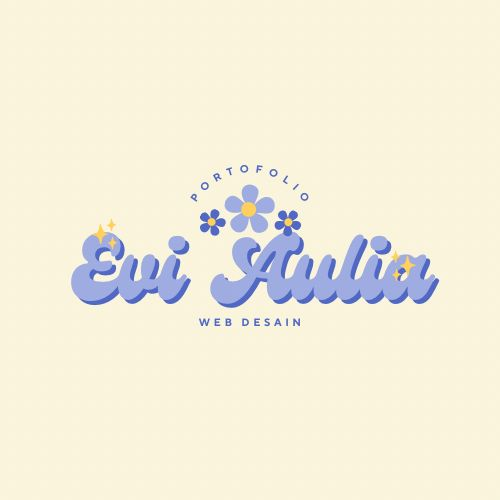
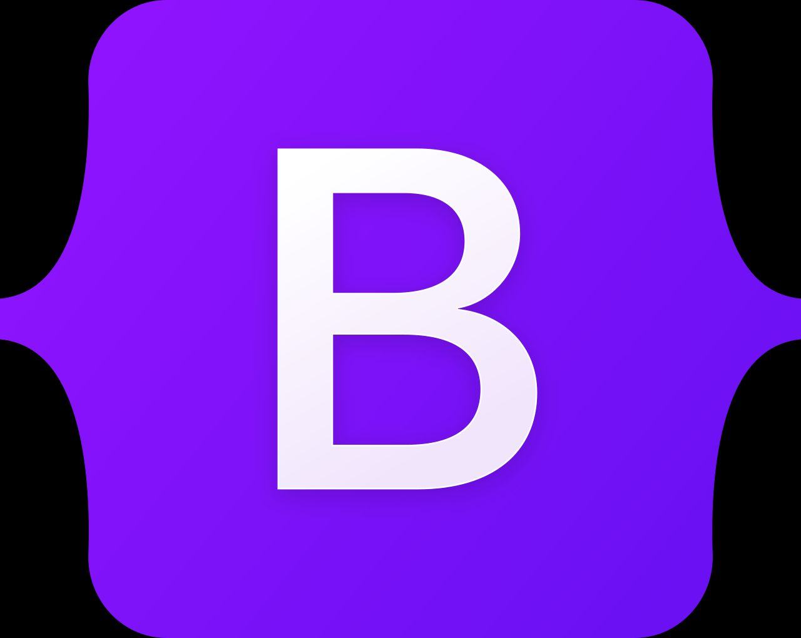
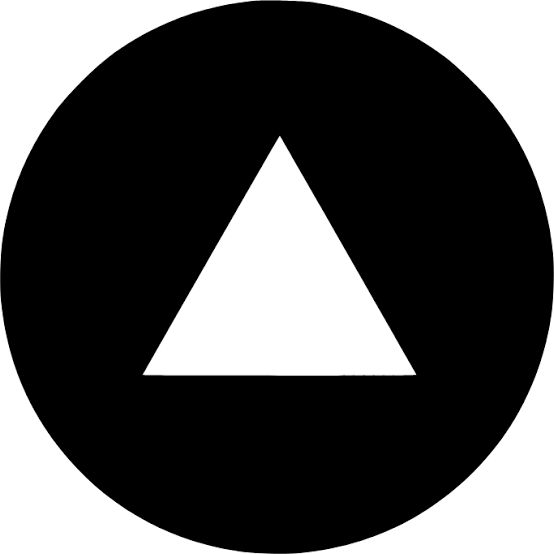
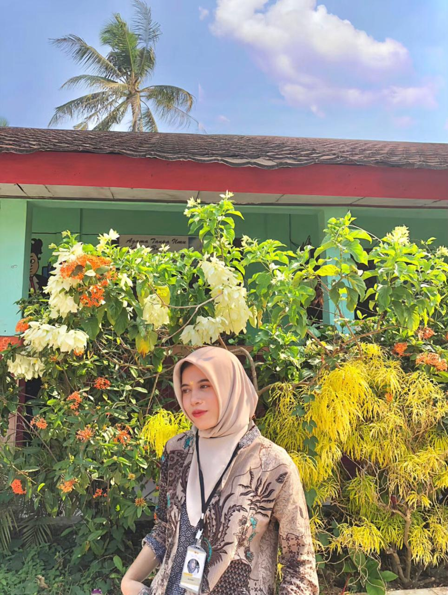
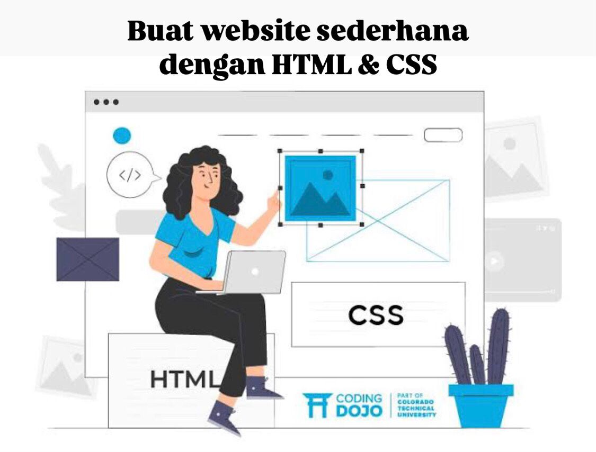
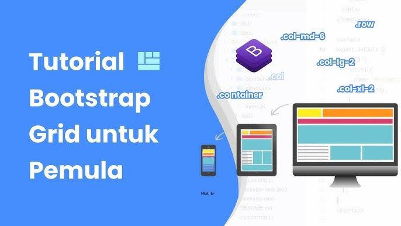

<head>
    <meta charset="UTF-8">
    <meta name="viewport" content="width=device-width, initial-scale=1.0">
    <title>Website Portofolio</title>
    <link rel="stylesheet" href="css/style.css" />
    <link rel="stylesheet" href="https://cdnjs.cloudflare.com/ajax/libs/font-awesome/6.6.0/css/all.min.css" integrity="sha512-Kc323vGBEqzTmouAECnVceyQqyqdsSiqLQISBL29aUW4U/M7pSPA/gEUZQqv1cwx4OnYxTxve5UMg5GT6L4JJg==" crossorigin="anonymous" referrerpolicy="no-referrer" />
</head>
<body>
    <!-- menu -->
    <nav>
        

            

            

                <ul>
                    <li><a href="">Premium course</a></li>
                    <li><a href="">Tentang saya</a></li>
                    <li><a href="">Free course</a></li>      
                </ul>
            

            <button class="hamburger-menu">
                <i class="fa-solid fa-bars"></i>
                <i class="fa-solid fa-xmark"></i>
            </button>
        

    </nav>

    <!-- hero/jumbotron -->
     <header>
        

        

            <h4>aulviawh05</h4>
            <h5>Web Portofolio  Mata kuliah Web Desain </h5>
            
Belajar html css itu tidak mudah untuk dikuasai, maka rajin-rajinlah Belajar

            <a href="" class="button button-xl">Mulai Sekarang</a>
        

     </header>

     <!-- statistic -->
     <section id="statistic">
        

            

                
<i class="fa-brands fa-github"></i>

            <small>aul_hub</small>
            

            

                
<i class="fa-brands fa-instagram"></i>

            <small>aulviawh05</small>
            

            

                
<i class="fa-solid fa-phone"></i>

            <small>(+62)85923330221</small>
            

        

     </section>

     <!-- Premium Course  -->
      <section id="Premium-Course">
        

            <h4>Premium Course</h4>
            
ikuti beragam website ku sesuai minat anda

            

                

                    
                    

                        
Make 50 websites using Boostrap

                        

                            <small><i class="fa-solid fa-clock"></i>50 jam</small>
                            <a href="" class="button"><i class="fa-solid fa-cart-shopping"></i>ikuti</a>
                        

                    

                

                

                    
                    

                        
Make 50 websites using Boostrap

                        

                            <small><i class="fa-solid fa-clock"></i>50 jam</small>
                            <a href="" class="button"><i class="fa-solid fa-cart-shopping"></i>ikuti</a>
                        

                    

                

                

                    
                    

                        
Make 50 websites using Boostrap

                        

                            <small><i class="fa-solid fa-clock"></i>50 jam</small>
                            <a href="" class="button"><i class="fa-solid fa-cart-shopping"></i>ikuti</a>
                        

                    

                

            
    
        

      </section>

      <!-- Tentang Saya -->
      <section id="tentang-saya">
        

            <h4>Tentang Saya</h4>
            
saya teman belajar pemrograman anda

            

                

                

                    
Mulai membuat website profil di tahun 2024.

                    
Supaya bisa menghasilkan cuan, bisa belajar dan berbagi ilmu

                    

                        <a href=""><i class="fa-brands fa-tiktok"></i></a>
                        <a href=""><i class="fa-brands fa-linkedin"></i></a>
                        <a href=""><i class="fa-brands fa-facebook"></i></a>
                        <a href=""><i class="fa-brands fa-twitter"></i></a>
                        <a href=""><i class="fa-solid fa-envelope"></i></a>
                        <a href=""><i class="fa-brands fa-youtube"></i></a>
                    

                

            

        

      </section>

      <!-- free course -->
      <section id="free-course">
        

            <h4>Free Course</h4>
            
kursus pemrograman gratis!

            

                

                    

                        
                        

                            <small><i class="fa-solid fa-clock"></i>50 jam</small>
                            <a href="" class="button"><i class="fa-solid fa-arrow-right"></i>ikuti</a>
                        

                    

                

                

                    

                        
                        

                            <small><i class="fa-solid fa-clock"></i>50 jam</small>
                            <a href="" class="button"><i class="fa-solid fa-arrow-right"></i>ikuti</a>
                        

                    

                 

                 

                    

                    
                        
                        

                            <small><i class="fa-solid fa-clock"></i>50 jam</small>
                            <a href="" class="button"><i class="fa-solid fa-arrow-right"></i>ikuti</a>
                        

                    

                

            

     

      <footer>
        
&copy; 2024 website portofolio diweb Aul

      </footer>

